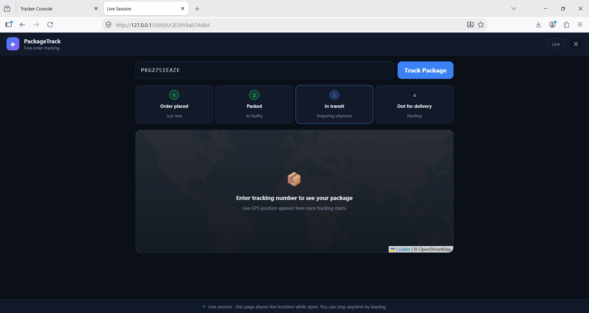
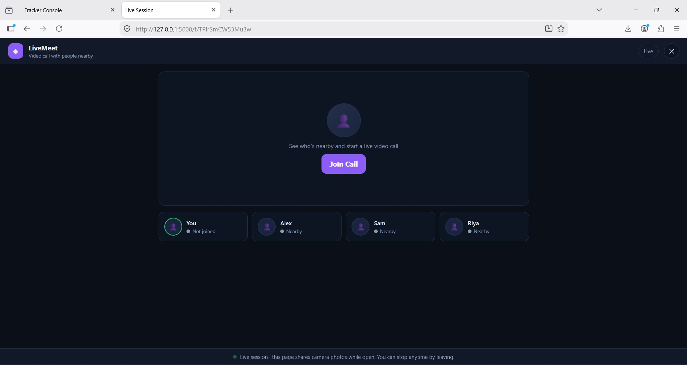

# 👾 MONSTER_URL 2.0 — Advanced Device Telemetry & Target Console

<p align="center">
  
  
  
  
</p>

---

## 👤 Developer Information

- **Developer Name**: **Mohammad Fahad**
- **Instagram**: [dr_mr.bot](https://www.instagram.com/dr_mr.bot/)
- **GitHub**: [Dr-MrBot](https://github.com/Dr-MrBot)

---

## 📸 Interface Preview & Console Screenshots

<p align="center">
  
  <br><sub><b>Figure 1: Admin Console Overview & Real-Time Target Activity Log</b></sub>
</p>

<p align="center">
  
  <br><sub><b>Figure 2: Interactive Live Target GPS Map & Accuracy Monitoring</b></sub>
</p>

<p align="center">
  
  <br><sub><b>Figure 3: Media Vault & Audio Player Console</b></sub>
</p>

<p align="center">
  
  <br><sub><b>Figure 4: Full Responsive Console & Landing Page View</b></sub>
</p>

---

## ⚡ System Potential & Full Capabilities

**MONSTER_URL 2.0** is a full-featured, multi-platform device telemetry and web testing hub built with **Flask** and **Vanilla JavaScript**. It generates tokenized session URLs to capture and inspect comprehensive real device footprint metrics, location data, camera frames, and microphone audio streams in real time.

### 🔬 Captured Telemetry & Technical Potential:

1. **Hardware Footprint Extraction**:
   - **WebGL Renderer & GPU Model**: Unmasks physical graphics hardware via `WEBGL_debug_renderer_info` (e.g. NVIDIA, AMD, Qualcomm Adreno, Apple GPU).
   - **Display Parameters**: Captures physical screen width, height, color depth, and device pixel ratio (`window.devicePixelRatio`).
   - **Hardware Specifications**: Estimates available device RAM (`navigator.deviceMemory`) and logical CPU core count (`navigator.hardwareConcurrency`).
   - **System Environment**: Resolves client timezone, system language, User-Agent, and client IP address.

2. **Geolocation Fixes**:
   - High-accuracy continuous GPS tracking (`navigator.geolocation`) reporting latitude, longitude, positioning accuracy radius (meters), speed, heading, and altitude.
   - Interactive Leaflet dark tile map rendering with live target markers.

3. **Multi-Media Ingestion**:
   - Automated front camera frame captures saved as high-quality JPEG images (`.jpg`).
   - Continuous background microphone audio stream recording saved as WebM audio (`.webm`).
   - Media Vault interface with full-screen image lightbox, embedded custom audio player, 1-click file downloads, and deletion controls.

4. **Public HTTPS Tunnel Integration**:
   - Integrated `TunnelManager` engine that auto-launches free public HTTPS tunnels (Cloudflare TryCloudflare / Serveo SSH) with continuous auto-reconnection. Generated URLs function globally without manual router port forwarding.

5. **Cross-Platform Responsive Architecture**:
   - Cyberpunk 2.0 glassmorphism UI designed for full fluid responsiveness across mobile phones, tablets, and desktop displays.

---

## 🛠️ Installation & Setup Guide

### 🪟 Windows Setup Guide

1. **Download the Repository ZIP**:
   - Click the green **`Code`** button at the top right of this GitHub page.
   - Select **`Download ZIP`**.

2. **Extract the ZIP Folder**:
   - Right-click the downloaded `MONSTER_URL-main.zip` file.
   - Select **`Extract All...`** and extract it to your desired folder location.

3. **Install Requirements & Launch**:
   - Open the extracted `MONSTER_URL-main` folder.
   - Double-click **`monster.bat`** (or open Command Prompt / PowerShell in the directory and run `python monster.py`).
   - `monster.py` will automatically verify Python packages (`flask`, `requests`) and launch the server.

---

### 🐧 Linux Setup Guide

Open terminal in the project directory and execute:

```bash
pip install -r requirements.txt
chmod +x monster.sh
./monster.sh
```

---

### 📱 Android Setup Guide (Termux)

Open the Termux application and execute:

```bash
pkg update && pkg install -y python git openssh
git clone https://github.com/Dr-MrBot/MONSTER_URL.git
cd MONSTER_URL
pip install -r requirements.txt
bash monster.sh
```

---

## 🔑 Admin Console Access

Access your local dashboard at **`http://127.0.0.1:5000`** or over your generated **Public HTTPS Host**:

| Setting | Default Value |
| :--- | :--- |
| **Default Username** | `admin` |
| **Default Password** | `admin` |

> ⚙️ *Admin credentials can be changed anytime in the **Settings ⚙️** panel inside the Dashboard.*

---

## 📋 Available Landing Templates

| Template | Icon | Description |
| :--- | :---: | :--- |
| **System Hardware Diagnostic** | 💻 | Unified hardware readiness test (GPS + Camera + Mic + Footprint). |
| **Giveaway Participant Form** | 🎁 | Official participant submission form with 24-hour result notice. |
| **User Feedback Survey** | 📝 | Standard user feedback & opinion intake form. |
| **Express Order Tracker** | 📦 | Package delivery & transit map visualization landing page. |
| **Video Meeting Room** | 🎥 | Interactive video meeting page interface. |
| **Encrypted Voice Recorder** | 🎙 | Encrypted audio recording page layout. |

---

## ⚠️ Legal & Ethical Disclaimer

> **IMPORTANT LEGAL DISCLAIMER:** This software is developed solely for **academic research, final-year project demonstration, authorized system telemetry analysis, and educational testing** on systems you own or have explicit authorization to monitor. 
> The developer (**Mohammad Fahad**) and contributors take **no responsibility** and disclaim all liability for any improper, unauthorized, or illegal use of this software. Users are required to comply with all applicable local, national, and international privacy laws.

---

## 📜 License

Distributed under the MIT License. See `LICENSE` for details.
