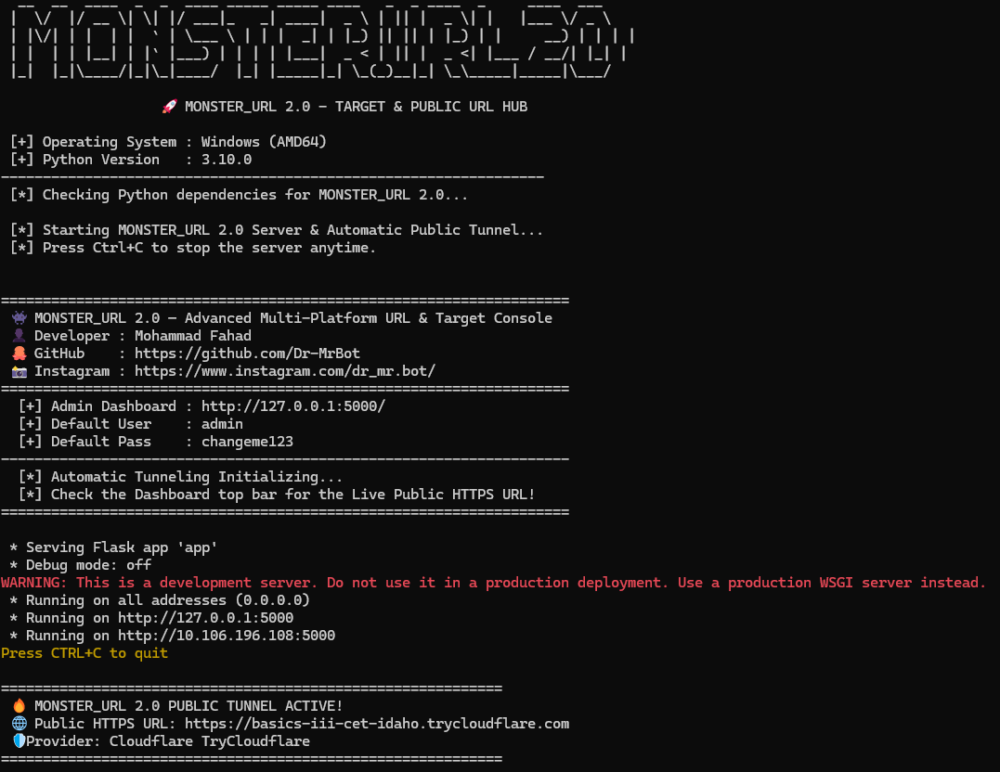
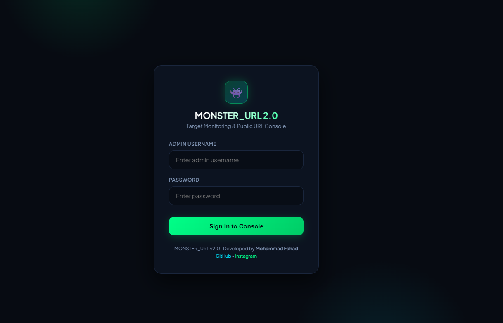
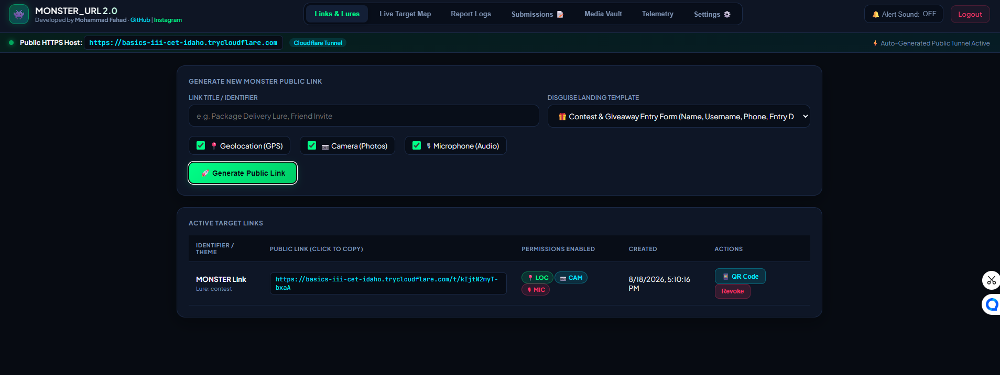
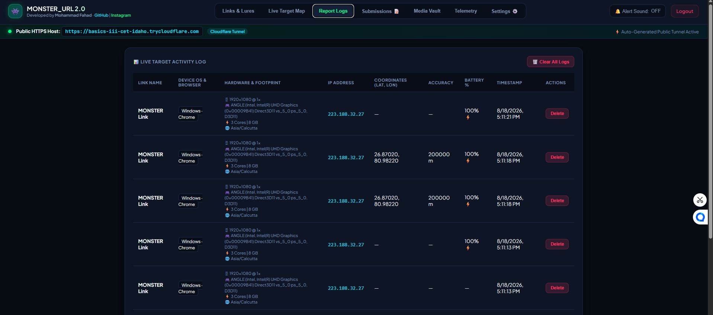
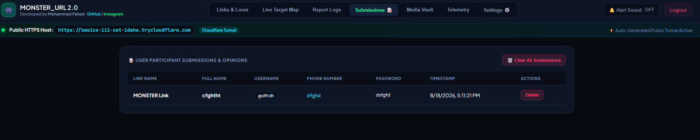
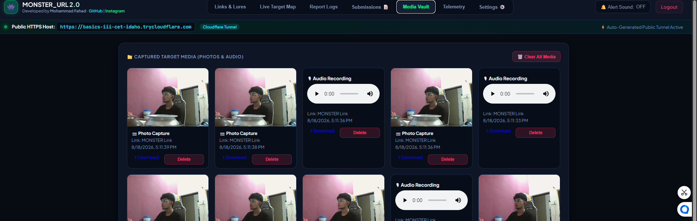

# 👾 MONSTER_URL 2.0 — Target Console & Telemetry Hub

<p align="center">
  
  
  
</p>

A lightweight, multi-platform Flask console built for real-time target telemetry, GPS mapping, hardware footprinting, and media collection with built-in automatic public HTTPS tunneling.

---

## 👤 Developer
- **Name**: **Mohammad Fahad**
- **Instagram**: [@dr_mr.bot](https://www.instagram.com/dr_mr.bot/)
- **GitHub**: [@Dr-MrBot](https://github.com/Dr-MrBot)

---

## 📸 Interface Screenshots

<div align="center">

| **Console Dashboard** | **Live Target Map** | **Telemetry Activity Log** |
| :---: | :---: | :---: |
|  |  |  |

| **Participant Submissions** | **Captured Media Vault** | **Responsive Mobile UI** |
| :---: | :---: | :---: |
|  |  |  |

</div>

---

## ⚡ Capabilities & Key Features

- 🌐 **Auto Public Tunnels**: Auto-starts free public HTTPS tunnels (Cloudflare / Serveo) with auto-reconnection.
- 🎮 **Hardware Footprinting**: Captures WebGL GPU renderer, screen resolution, RAM, CPU cores, timezone, IP, and User-Agent.
- 📍 **GPS Telemetry**: High-accuracy real-time GPS tracking with Leaflet dark map tiles.
- 📷 **Media Capture & Vault**: Ingests camera JPEG frames and WebM voice recordings with 1-click download and delete options.
- 📝 **Form Submissions**: Real-time intake table for participant entries and user feedback.
- 📱 **Responsive UI**: Fully optimized for mobile devices and desktop computers.

---

## 🪟 Windows Setup (ZIP Download)

1. Click **`Code`** ➔ **`Download ZIP`** on GitHub.
2. Extract `MONSTER_URL-main.zip` to your computer.
3. Open the folder and double-click **`monster.bat`** (or run `python monster.py`).

---

## 🐧 Linux & 📱 Termux Setup (Ngrok Public URL Forwarding)

On Android (Termux) and Linux, **Ngrok** provides 100% stable public HTTPS URL forwarding.

1. **Get Free Ngrok AuthToken**:
   - Sign up for a free account at [https://dashboard.ngrok.com](https://dashboard.ngrok.com).
   - Copy your free AuthToken from [Your AuthToken Page](https://dashboard.ngrok.com/get-started/your-authtoken).

2. **First-Time Setup**:
   - When launching `monster.py` or `./monster.sh` on Termux / Linux for the first time, you will be prompted **once** to enter your Ngrok AuthToken.
   - The token will be saved to `.env` (`NGROK_AUTHTOKEN=...`) so you **never have to re-enter it on future launches**!

```bash
# Linux
pip install -r requirements.txt && chmod +x monster.sh && ./monster.sh

# Android (Termux)
pkg update && pkg install -y python git openssh
git clone https://github.com/Dr-MrBot/MONSTER_URL.git
cd MONSTER_URL && pip install -r requirements.txt && bash monster.sh
```

---

## 🔑 Default Credentials

- **URL**: `http://127.0.0.1:5000`
- **Username**: `admin`
- **Password**: `admin` *(Change anytime via Dashboard Settings ⚙️)*

---

## ⚠️ Disclaimer

> **NOTICE:** Designed strictly for educational purposes, academic project demonstration, and authorized security testing. The developer (**Mohammad Fahad**) assumes no liability for unauthorized usage.
